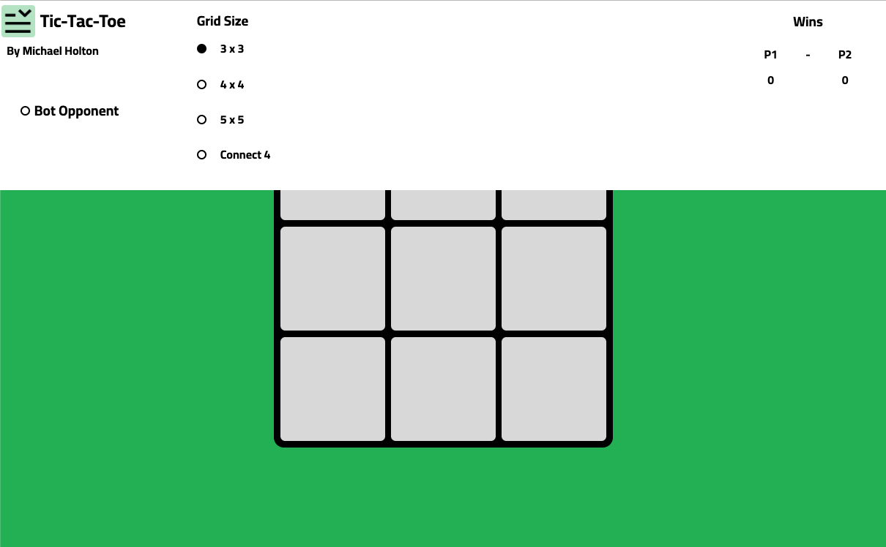

# Tic-Tac-Toe

A widely recognised game which sizes up the strategic ability of two players, win by completing a line on the grid with your shape.

The game is available at https://mikey712712.github.io/Tic-Tac-Toe/

##   **Game Features**

### **Bot Opponent**

Can you outsmart the computer? Play against an AI designed to prevent the player from winning while setting up winning combinations of it's own.

###   **Changeable Grid Size**

Play Tic-Tac-Toe on a 4x4 or 5x5 grid to make things more interesting.

###   **Connect 4**

The app also features Connect 4, the goal of this game is to complete any line of 4 by dropping your shape into the 5 x 5 grid.

 

Use the dropdown bar to access all features

 

## **Technologies Used**

The app is entirely built using front-end web development languages, specifically:

<ol>
    <li>Javascript</li>
    <li>HTML5</li>
    <li>CSS3</li>
</ol>
The app is deployed through Github pages.
